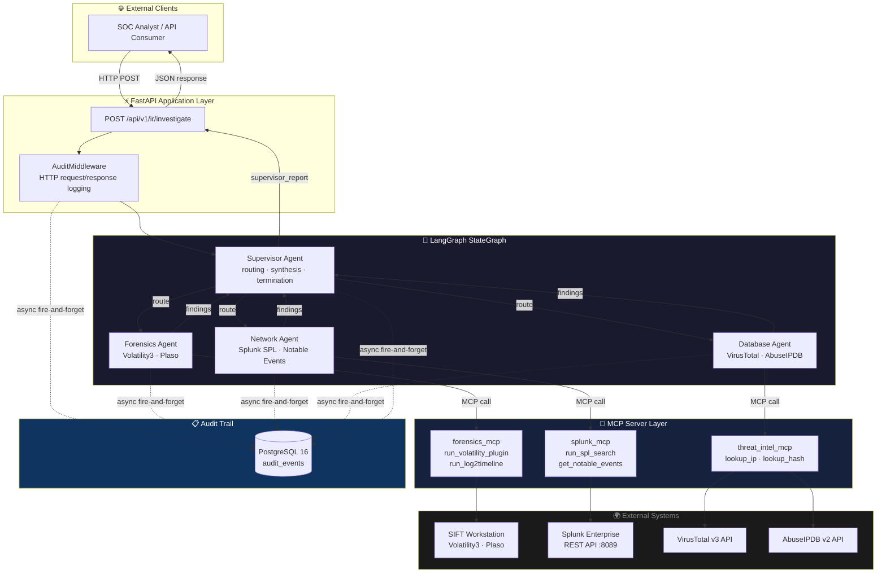
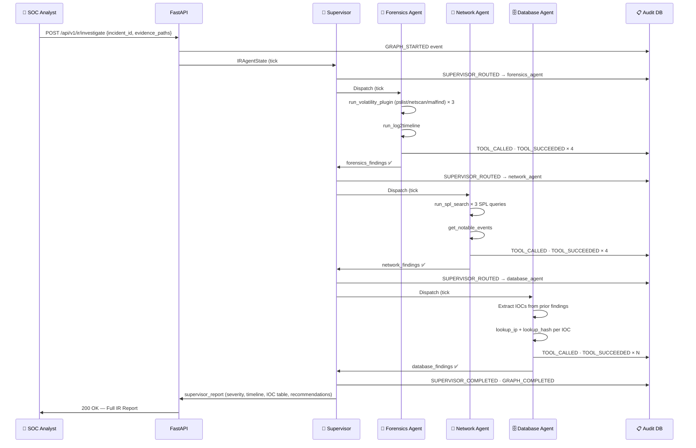
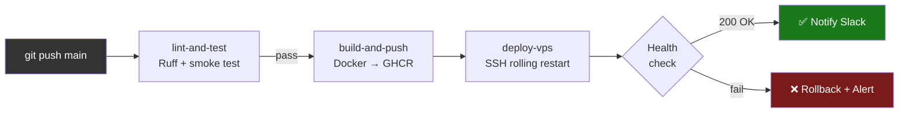

<div align="center">

# 🔍 TaxLens-AI
### Multi-Agent Incident Response & Observability Platform

[](https://github.com/VietGamer-UIT/TaxLens-AI/actions)
[](https://python.org)
[](https://github.com/langchain-ai/langgraph)
[](https://fastapi.tiangolo.com)
[](https://postgresql.org)
[](https://docker.com)
[](LICENSE)

> **Built for SANS "FIND EVIL!" & Splunk Agentic Ops Hackathons**  
> Production-grade, fully auditable Multi-Agent IR Platform powered by LangGraph, custom MCP servers, and an immutable PostgreSQL audit trail.

</div>

---

## 📌 Table of Contents

1. [Overview](#overview)
2. [Key Features](#key-features)
3. [System Architecture](#system-architecture)
4. [Agent Data Flow](#agent-data-flow)
5. [MCP Server Registry](#mcp-server-registry)
6. [Audit Trail Schema](#audit-trail-schema)
7. [Quick Start with Docker](#quick-start-with-docker)
8. [Environment Variables](#environment-variables)
9. [Project Structure](#project-structure)
10. [CI/CD Pipeline](#cicd-pipeline)
11. [Hackathon Alignment](#hackathon-alignment)

---

## Overview

**TaxLens-AI** is a production-grade **Incident Response (IR) platform** that replaces manual SOC triage workflows with a coordinated fleet of autonomous AI agents. Each agent specialises in a specific IR domain — **digital forensics**, **SIEM correlation**, and **threat intelligence enrichment** — and communicates through a typed, stateful LangGraph graph under the coordination of a **Supervisor agent**.

Every tool invocation, routing decision, agent state transition, and LLM token expenditure is captured in an **immutable PostgreSQL audit ledger** with SHA-256 state hashing, providing the evidence chain integrity demanded by SANS forensic standards.

---

## Key Features

| Feature | Description |
|---|---|
| 🤖 **LangGraph Multi-Agent** | Supervisor + 3 specialist agents with deterministic routing and self-correction (max 3 retries per tool) |
| 🔌 **Custom MCP Servers** | Type-safe wrappers for SIFT/Volatility3, Plaso/log2timeline, Splunk REST API, VirusTotal v3, and AbuseIPDB |
| 🛡️ **Read-Only Enforcement** | Write-operation denylist blocks `rm`, `mv`, shell redirects, and SPL mutation commands at the MCP layer |
| 📋 **Immutable Audit Trail** | PostgreSQL `audit_events` table with UUID PK, SHA-256 state hashes, JSONB GIN indexes, and zero UPDATE/DELETE paths |
| ⚡ **Async-First** | SQLAlchemy 2.x async engine + asyncpg; all MCP calls are `asyncio`-native; audit writes are fire-and-forget background tasks |
| 🐳 **Enterprise DevOps** | Multi-stage Docker build, non-root container user (UID 1001), GHCR image push, SSH rolling deploy, Slack notifications |
| 🔍 **Pydantic v2 Validation** | All MCP tool inputs enforce `StrictStr`, regex format checks (IPv4, hex hashes), and `model_validator` guard rails |

---

## System Architecture



---

## Agent Data Flow



---

## MCP Server Registry

| Tool Name | Server | Wraps | Input Schema |
|---|---|---|---|
| `run_volatility_plugin` | `forensics_mcp` | `vol -f <image> <plugin>` | `VolatilityInput` |
| `run_log2timeline` | `forensics_mcp` | `log2timeline.py` | `Log2TimelineInput` |
| `run_spl_search` | `splunk_mcp` | `POST /services/search/jobs` | `SPLSearchInput` |
| `get_notable_events` | `splunk_mcp` | ES Notable Events saved search | `NotableEventsInput` |
| `lookup_ip` | `threat_intel_mcp` | VT `/ip_addresses/<ip>` + AbuseIPDB `/check` | `IPLookupInput` |
| `lookup_hash` | `threat_intel_mcp` | VT `/files/<hash>` | `HashLookupInput` |

All tools are registered via `@mcp_tool(name)` decorator and discoverable through `MCP_TOOL_REGISTRY`.

---

## Audit Trail Schema

```sql
-- audit_events: Immutable append-only ledger (zero UPDATE/DELETE paths)
CREATE TABLE audit_events (
    id                  UUID PRIMARY KEY DEFAULT gen_random_uuid(),
    incident_id         VARCHAR(128) NOT NULL,      -- Incident correlation
    graph_run_id        VARCHAR(128) NOT NULL,      -- Single .ainvoke() session
    event_type          event_type_enum NOT NULL,   -- TOOL_CALLED, AGENT_STARTED, ...
    agent_name          agent_name_enum NOT NULL,   -- supervisor, forensics_agent, ...
    status              event_status_enum NOT NULL, -- ok, error, partial, blocked
    tool_name           VARCHAR(256),               -- MCP tool identifier
    tool_input_json     JSONB,                      -- Redacted Pydantic input
    tool_output_json    JSONB,                      -- Full tool response
    retry_attempt       INTEGER NOT NULL DEFAULT 0, -- Self-correction counter
    error_type          VARCHAR(256),               -- Exception class name
    error_message       TEXT,                       -- Truncated at 4096 chars
    token_prompt        INTEGER NOT NULL DEFAULT 0, -- LLM input tokens
    token_completion    INTEGER NOT NULL DEFAULT 0, -- LLM output tokens
    token_total         INTEGER NOT NULL DEFAULT 0, -- Indexed for SUM queries
    state_snapshot_json JSONB,                      -- Partial IRAgentState
    sha256_state_hash   VARCHAR(64),               -- Tamper detection
    duration_ms         INTEGER,                    -- Wall-clock latency
    recorded_at         TIMESTAMPTZ DEFAULT NOW()   -- DB-authoritative clock
);
-- GIN indexes on JSONB columns for Splunk-style JSON path queries
-- Partial index on (tool_name, status) WHERE status = 'error' for failure analysis
```

**Tamper detection**: Re-compute `sha256(canonical_json(state_snapshot_json))` and compare to `sha256_state_hash` to verify a row has not been modified.

---

## Quick Start with Docker

### Prerequisites
- Docker Engine ≥ 24.x
- Docker Compose Plugin ≥ 2.x

```bash
# 1. Clone the repository
git clone https://github.com/VietGamer-UIT/TaxLens-AI.git
cd TaxLens-AI

# 2. Configure environment
cp .env.example .env
# Edit .env — fill in GOOGLE_API_KEY, VIRUSTOTAL_API_KEY, etc.
nano .env

# 3. Build and start all services (PostgreSQL + FastAPI backend)
docker compose up --build -d

# 4. Verify services are healthy
docker compose ps
# Expected: taxlens_db (healthy) · taxlens_backend (healthy)

# 5. Run a sample incident investigation
curl -X POST http://localhost:8000/api/v1/ir/investigate \
  -H "Content-Type: application/json" \
  -H "X-Incident-ID: IR-2024-DEMO-001" \
  -d '{
    "incident_id": "IR-2024-DEMO-001",
    "evidence_paths": ["/evidence/dc01_mem.raw"]
  }'

# 6. View the audit trail
curl http://localhost:8000/api/v1/audit/events?incident_id=IR-2024-DEMO-001

# 7. View logs
docker compose logs -f backend
```

### Smoke Test (no Docker required)
```bash
pip install -r requirements.txt
python -m Backend.FastAPI.ir_agents.graph_builder
# Expected: Full IR report printed — status=complete, severity=CRITICAL, 4 iterations
```

---

## Environment Variables

Copy `.env.example` to `.env` and populate the following:

| Variable | Required | Description | Default |
|---|---|---|---|
| `GOOGLE_API_KEY` | ✅ | Google Gemini API key | — |
| `POSTGRES_USER` | ✅ | PostgreSQL username | `taxlens` |
| `POSTGRES_PASSWORD` | ✅ | PostgreSQL password | `changeme_in_prod` |
| `POSTGRES_DB` | ✅ | Audit database name | `taxlens_audit` |
| `POSTGRES_HOST` | — | DB hostname (Docker service name) | `db` |
| `POSTGRES_PORT` | — | DB port | `5432` |
| `SPLUNK_BASE_URL` | — | Splunk REST API base URL | `https://splunk.local:8089` |
| `SPLUNK_TOKEN` | — | Splunk Bearer token | Mock mode |
| `VIRUSTOTAL_API_KEY` | — | VirusTotal v3 API key | Mock mode |
| `ABUSEIPDB_API_KEY` | — | AbuseIPDB v2 API key | Mock mode |
| `LOG_LEVEL` | — | Uvicorn log level | `info` |
| `BACKEND_PORT` | — | Host port for FastAPI | `8000` |

> **Note:** Without threat intelligence API keys, the platform runs in **mock mode** — all MCP tools return realistic dummy data. Full functionality requires live API keys.

---

## Project Structure

```
TaxLens-AI/
├── Backend/
│   └── FastAPI/
│       ├── main.py                    # FastAPI app factory + lifespan
│       ├── mcp_servers/               # COMMIT 1: Custom MCP Tool Servers
│       │   ├── __init__.py            #   Master MCP_TOOL_REGISTRY
│       │   ├── forensics_mcp.py       #   SIFT: Volatility3 + Plaso
│       │   ├── splunk_mcp.py          #   Splunk REST API
│       │   └── threat_intel_mcp.py    #   VirusTotal v3 + AbuseIPDB
│       ├── ir_agents/                 # COMMIT 2: LangGraph Multi-Agent
│       │   ├── __init__.py
│       │   ├── state.py               #   IRAgentState TypedDict
│       │   ├── supervisor.py          #   Master orchestrator
│       │   ├── forensics_agent.py     #   Memory & disk forensics
│       │   ├── network_agent.py       #   SIEM correlation
│       │   ├── database_agent.py      #   IOC enrichment
│       │   └── graph_builder.py       #   StateGraph factory
│       └── audit/                     # COMMIT 3: Audit Trail
│           ├── __init__.py
│           ├── database.py            #   Async PostgreSQL engine
│           ├── models.py              #   AuditEvent ORM model
│           └── middleware.py          #   HTTP middleware + decorators
├── DevOps/                            # COMMIT 4: DevOps Stack
│   └── Docker/
│       └── Dockerfile.backend         #   Multi-stage build (non-root)
├── .github/
│   └── workflows/
│       └── deploy.yml                 #   CI/CD: lint → build → deploy
├── docs/                              # Deep-dive technical documentation
│   ├── architecture.md                #   LangGraph Multi-Agent design
│   ├── mcp_servers.md                 #   MCP read-only skill strategy
│   └── deployment.md                  #   Local & CI/CD deployment guide
├── docker-compose.yml                 #   FastAPI + PostgreSQL stack
├── .env.example                       #   Environment variable template
├── requirements.txt                   #   Python dependencies
└── README.md                          #   This file
```

---

## CI/CD Pipeline



**GitHub Secrets required:**

| Secret | Purpose |
|---|---|
| `GHCR_TOKEN` | GitHub PAT (`packages:write`) for GHCR image push |
| `VPS_HOST` | Production server IP / hostname |
| `VPS_USER` | SSH user on deployment server |
| `VPS_SSH_KEY` | ED25519 private key (no passphrase) |
| `VPS_DEPLOY_PATH` | Absolute deploy path on VPS (e.g. `/opt/taxlens-ai`) |
| `SLACK_WEBHOOK_URL` | (Optional) Slack webhook for deployment alerts |

---

## Hackathon Alignment

### SANS "FIND EVIL!" Criteria

| Criterion | TaxLens-AI Implementation |
|---|---|
| **Evidence Integrity** | SHA-256 hash of IRAgentState snapshot stored per event in `audit_events.sha256_state_hash` |
| **Forensic Tool Integration** | MCP wrappers for Volatility3 (pslist, netscan, malfind) and log2timeline/Plaso |
| **Audit Trail** | Immutable PostgreSQL ledger — zero UPDATE/DELETE code paths; DB-server clock (`recorded_at`) |
| **Read-Only Operations** | Write-op denylist in `forensics_mcp.py`; SPL mutation guard in `splunk_mcp.py` |
| **Structured Output** | Every tool returns `{"status": "ok"|"error", "data": {...}}` — machine-parseable chain of evidence |

### Splunk Agentic Ops Criteria

| Criterion | TaxLens-AI Implementation |
|---|---|
| **SPL Integration** | `run_spl_search` wraps full Splunk REST job lifecycle (create → poll → fetch) |
| **Notable Events** | `get_notable_events` surfaces ES alerts with severity, risk score, and rule name |
| **Agentic Automation** | LangGraph Supervisor routes autonomously across 3 specialist agents without human intervention |
| **Observability** | `AuditMiddleware` captures every HTTP request; `@audit_tool_call` captures every tool call |
| **Token Accounting** | `token_prompt`, `token_completion`, `token_total` tracked per event for cost observability |

---

*Developed by Đoàn Hoàng Việt (Việt Gamer) — Principal Developer.*  
*TaxLens-AI v1.0.0 — SANS FIND EVIL! × Splunk Agentic Ops Hackathon 2024*
